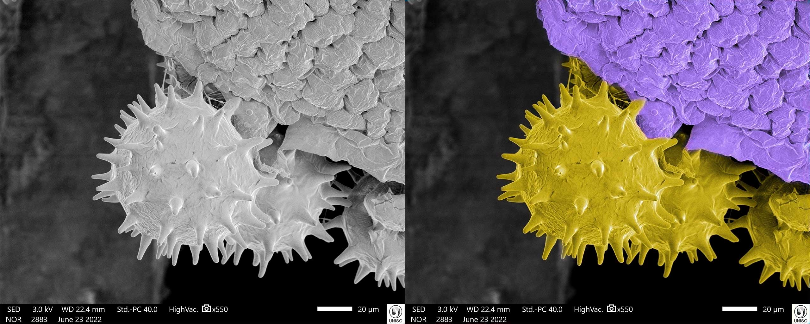
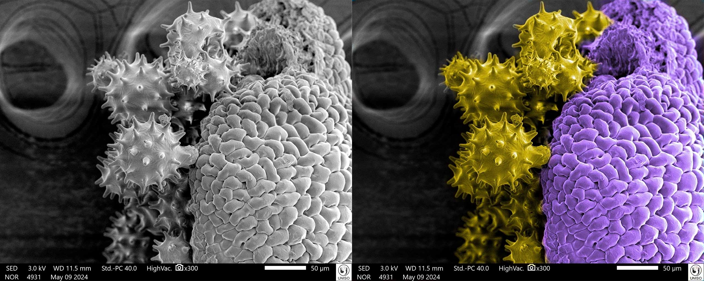
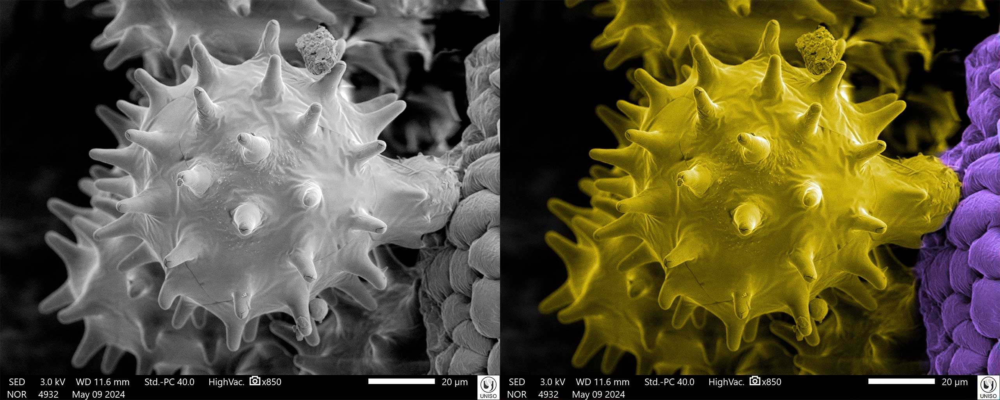
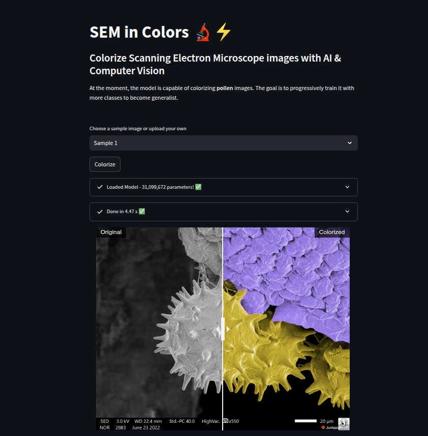

# SEM Image Colorization
Colorize Scanning Electron Microscope (SEM) images automatically using Deep Learning & Computer Vision

### Results
Original (grayscale) images and their colorized versions produced by this project

# The colorization problem
SEM images are, by the nature of the electron microscopes, color absent. Colorization is a important step to any SEM image because it helps us humans to better interpret it since the human brain works better when colors are present. However, the colorization process is slow and manual, demanding time and effort from researchers. The goal of this project is to create an automatic way of colorization.

# How it works
A cGAN (Conditional Generative Adversarial Network), based on [Pix2Pix](https://arxiv.org/pdf/1611.07004), is applied to the Image Colorization problem.
There are two networks that work together in an adversarial game: 
* Generator: UNet-based with Resnet18 as backbone
* Discriminator: PatchGAN 

During the optimization process, the Discriminator is trained to better differentiate the real images and the generated ones by the Generator. The Generator, in the opposite way, is optimized to generate images that better fool the Discriminator. This adversarial game produces a dynamic training behaviour in which, at the end, the goal is to produce a Generator good enough that fools the Discriminator, so the image it produces are good-looking and convincing.

The colorization is made by leveraging the LAB color space instead of RGB. The original image (grayscale) corresponds to the L channel and the remaining A and B channels are generated by the Generator model. Then the L, A and B channels are concatenated and a LAB image is produced. 
  
### Colorization diagram

# Setup the Environment

If you're using uv:

`uv sync`

If you're using pip, create a venv with python >=3.10 and install the dependencies with:

`pip install -r requirements.txt`

# Run the Web app

This is the recommended way to run the application, as it automatically sets up both the backend API and the frontend web app using Docker. You can choose between a simpler CPU-only or CUDA-accelerated build.

### Option 1: Run with CPU (Default)

This method works on any system with Docker installed and is best if you do not have an NVIDIA GPU.

### Build and Run the Containers:
From the project's root directory, run the following command. The --build flag is only necessary the first time you run it or after changing dependencies.

`docker-compose up --build`

### Option 2: Run with NVIDIA GPU (Recommended for Performance)
Use this method for significantly faster image colorization if you have a compatible NVIDIA GPU.

Prerequisites:

* An NVIDIA GPU

* The latest NVIDIA drivers for your OS

* The NVIDIA Container Toolkit installed on your system.

### Build and Run the Containers:
This command merges the base docker-compose.yml with the docker-compose.cuda.yml override file, which enables GPU access for the API service.

`docker-compose -f docker-compose.yml -f docker-compose.cuda.yml up --build`

### Access the Web App:
Once the containers are running, open your web browser and navigate to: http://localhost:8501

### Stopping the Application:

To stop the containers, run:
    
`docker-compose down`

# Steps to reproduce
The training happens in two stages. 

At first, the Generator is trained individually by being fine-tuned on the data using L1 loss as criterion. By doing so, it learns the context of the data and tune its parameters to better minimize the L1 loss between the generated outputs and the ground truth.

To pretrain the Generator, run the `pretrain.py` script with the desired hyperparameters. 

Then, the cGAN is trained to improve the Generator at its best. So the pretrained Generator is again fine-tuned from the pretrain's checkpoint.

To run the cGAN training, run:
`train_pix2pix.py`