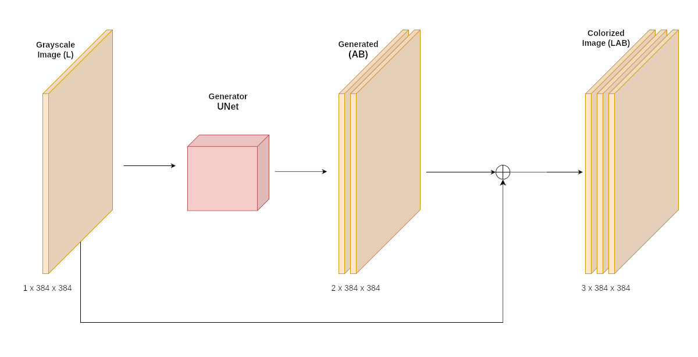

# SEM Image Colorization
### Colorize Scanning Electron Microscope (SEM) images automatically using Deep Learning & Computer Vision

This is a pilot project. At the moment, the model is capable of colorizing pollen images exclusively because pollens are more abundant in the available data from Uniso's SEM. The goal is to progressively train it with more classes to become generalist.

# The colorization problem
SEM images are, by the nature of the electron microscopes, color absent. Colorization is a important step to any SEM image because it helps us humans to better interpret it since the human brain works better when colors are present. However, the colorization process is slow and manual, demanding time and effort from researchers. The goal of this project is to create an automatic way of colorization.

# How it works
A cGAN (Conditional Generative Adversarial Network), based on [Pix2Pix](https://arxiv.org/pdf/1611.07004), is applied to the Image Colorization problem.
There are two networks that work together in an adversarial game: 
* Generator: UNet-based with Resnet18 as backbone
* Discriminator: PatchGAN 

During the optimization process, the Discriminator is trained to better differentiate the real images and the generated ones by the Generator. The Generator, in the opposite way, is optimized to generate images that better fool the Discriminator. This adversarial game produces a dynamic training behaviour in which, at the end, the goal is to produce a Generator good enough that fools the Discriminator, so the image it produces are good-looking and convincing.

The colorization is made by leveraging the LAB color space instead of RGB. The original image (grayscale) corresponds to the L channel and the remaining A and B channels are generated by the Generator model. Then the L, A and B channels are concatenated and a LAB image is produced. 
  
### Colorization diagram

# Setup the Environment
Create the conda environment with:

`conda create --name colorization --file environment.yml`

# Steps to reproduce
The training happens in two stages. 

At first, the Generator is trained individually by being fine-tuned on the data using L1 loss as criterion. By doing so, it learns the context of the data and tune its parameters to better minimize the L1 loss between the generated outputs and the ground truth.

To pretrain the Generator, run the `pretrain.py` script with the desired hyperparameters. 

Then, the cGAN is trained to improve the Generator at its best. So the pretrained Generator is again fine-tuned from the pretrain's checkpoint.

To run the cGAN training, run:
`train_pix2pix.py`

# Streamlit
Start the server with:

`streamlit run app.py`
